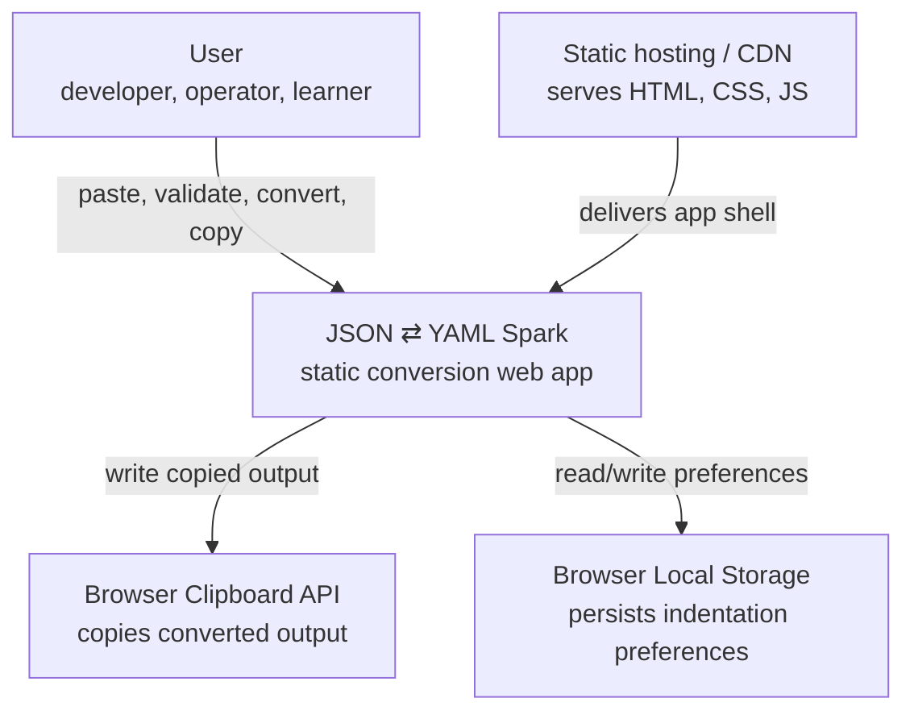
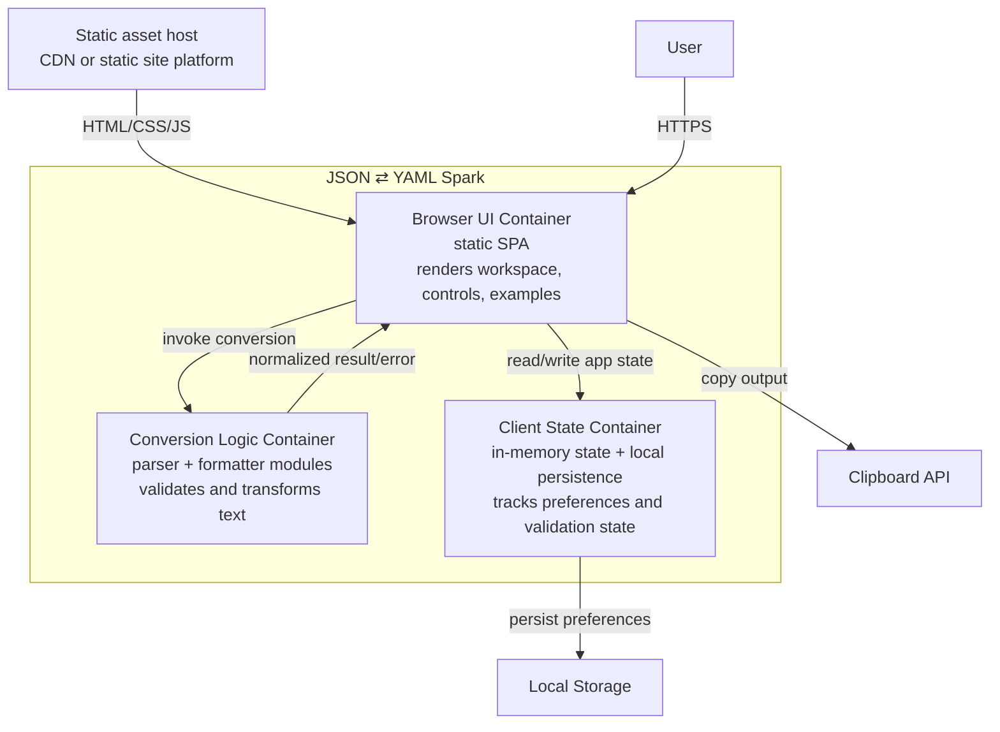
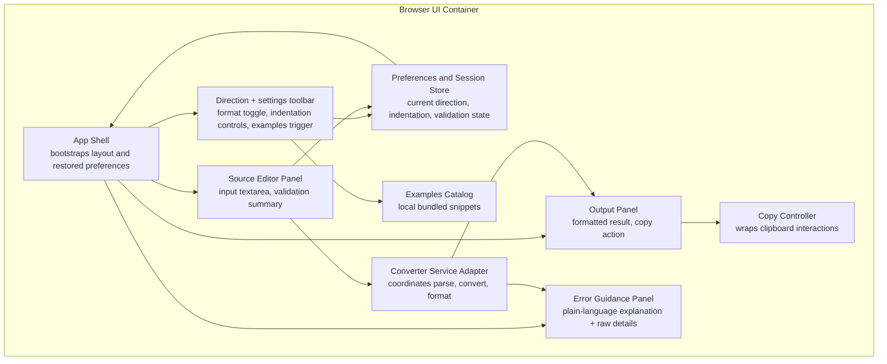

# C4 Architecture -- json-yaml-spark-0606

## Architectural Intent

The app is a fully static browser application. All parsing, validation, conversion, and formatting happen locally in the user's browser. This keeps the system simple, privacy-preserving, and aligned with the utility-tool use case described in the [PRD](../prd/project-prd.md).

## Level 1: System Context

## Level 2: Container Diagram

## Level 3: Component Diagram

## Boundaries and Integration Notes

- There is no backend application boundary in v1.
- The static host is replaceable infrastructure and does not hold business logic.
- Parser/formatter libraries are implementation details behind the converter service adapter.
- Browser platform integrations are limited to clipboard and local preference persistence.

## Failure and Recovery Model

- Parse failure stays local and produces a normalized UI error state.
- Copy failure is non-destructive; output remains present and retryable.
- Corrupt saved preferences fall back to safe defaults rather than blocking app startup.
