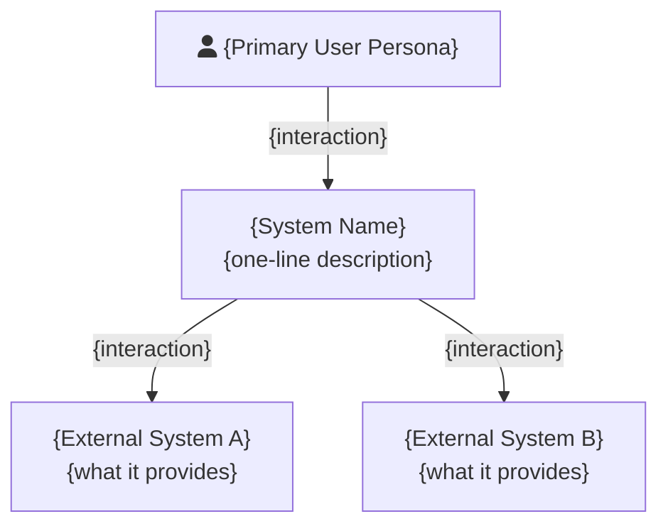
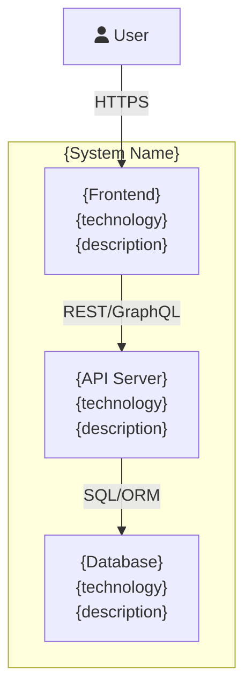
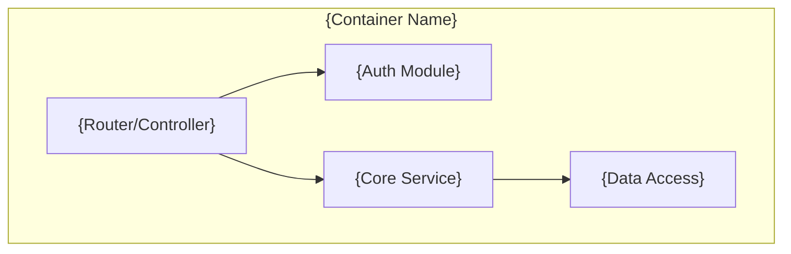

# C4 Architecture -- json-yaml-spark-0606

## Level 1: System Context

```mermaid
graph TD
    User["fa:fa-user {Primary User Persona}"]
    System["{System Name}<br/>{one-line description}"]
    ExtA["{External System A}<br/>{what it provides}"]
    ExtB["{External System B}<br/>{what it provides}"]

    User -->|"{interaction}"| System
    System -->|"{interaction}"| ExtA
    System -->|"{interaction}"| ExtB
```

## Level 2: Container Diagram

```mermaid
graph TD
    subgraph "{System Name}"
        FE["{Frontend}<br/>{technology}<br/>{description}"]
        API["{API Server}<br/>{technology}<br/>{description}"]
        DB["{Database}<br/>{technology}<br/>{description}"]
    end

    User["fa:fa-user User"] -->|"HTTPS"| FE
    FE -->|"REST/GraphQL"| API
    API -->|"SQL/ORM"| DB
```

## Level 3: Component Diagram

```mermaid
graph TD
    subgraph "{Container Name}"
        Router["{Router/Controller}"]
        Auth["{Auth Module}"]
        Service["{Core Service}"]
        Repo["{Data Access}"]
    end

    Router --> Auth
    Router --> Service
    Service --> Repo
```
