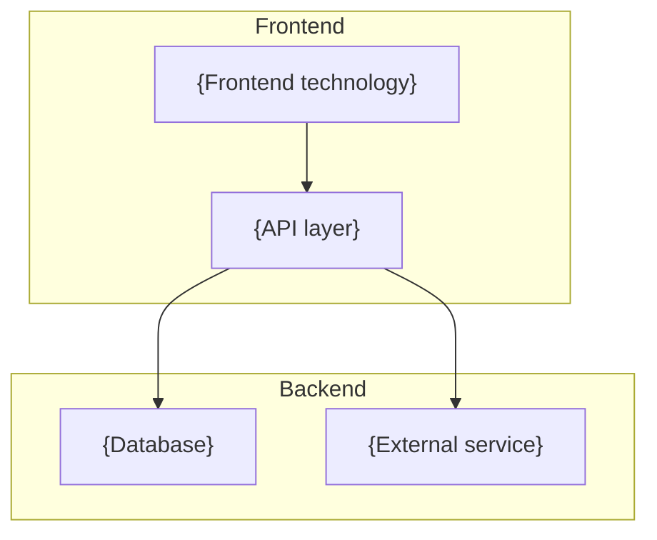

# Executive Brief -- json-yaml-spark-0606

> **Status:** Awaiting approval
> **Autonomy level:** {Standard / Fast-track / High-assurance}
> **Created:** {YYYY-MM-DD}
> **Project type:** {type}
> **Project traits:** {trait1, trait2}

## What We Think You Want

{2-3 sentences restating the human's intent in precise, concrete terms.}

## What We Will Build

- {Concrete deliverable 1}
- {Concrete deliverable 2}
- {Concrete deliverable 3}

## Key Screen Preview

  

    <b>{App Name}</b>
    &#9776;
  

  

    {Most important wireframe snippet from UX spec}
  

## What We Will NOT Build

- {Explicit exclusion 1}
- {Explicit exclusion 2}
- {Explicit exclusion 3}

## Top Risks

| Risk | Impact | Mitigation |
|------|--------|-----------|
| {Risk 1} | {impact} | {mitigation} |
| {Risk 2} | {impact} | {mitigation} |

## Recommended Approach

{Recommended stack, architecture, and reasoning in one paragraph.}

## Estimated Scope

- **Issues:** ~{N}
- **Complexity:** {Low / Medium / High}
- **Estimated time:** {N hours / N days}

## Detailed Docs

- [Research -- Knowledge Tree](../research/knowledge-tree.md)
- [Product Requirements (PRD)](../prd/project-prd.md)
- [UX Specification](../ux/ux-spec.md)
- [Architecture (C4)](../architecture/c4.md)
