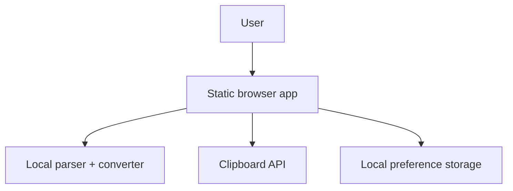

# Executive Brief -- json-yaml-spark-0606

> **Status:** Published for review
> **Autonomy level:** Standard
> **Created:** 2026-04-06
> **Project type:** Static web utility
> **Project traits:** privacy-preserving, responsive, converter, no-backend

## What We Think You Want

You want a polished browser-based utility that converts JSON to YAML and YAML to JSON without requiring a server. It needs to feel production-ready rather than like a bare demo: clear validation, understandable parse errors, stable indentation settings, copyable output, useful examples, and a layout that works well on desktop and mobile.

## What We Will Build

- A single-page static converter workspace with switchable direction: `JSON -> YAML` and `YAML -> JSON`
- Built-in validation and error guidance that surfaces line/column details and plain-language recovery hints
- Output formatting controls, copy-to-clipboard, bundled examples, and responsive desktop/mobile layouts

## Key Screen Preview

  

    
<b>JSON ⇄ YAML Spark</b>
Fast local conversion

    
Examples • Copy • 2-space indent

  

  

    

      
<b>JSON → YAML</b>

      
Input is valid

    

    

      

        <b>Source</b>
        
{ "env": "prod", "enabled": true }

      

      

        
<b>Output</b>Copy

        
env: prod
enabled: true

      

    

  

## What We Will NOT Build

- Accounts, saved projects, cloud history, or sharing links
- Schema-aware validation or arbitrary data transformation pipelines
- Server-side conversion infrastructure

## Top Risks

| Risk | Impact | Mitigation |
|------|--------|------------|
| YAML parser errors are too technical for casual users | Users may still feel blocked even though parsing is correct | Normalize raw parser output into line/column plus plain-language hints |
| Responsive layout becomes cramped on mobile | Core actions may be hidden or tedious on phones | Design the primary experience as stacked cards for 375px+ and avoid hover-only controls |
| Preference persistence behaves inconsistently | Output formatting may feel unreliable | Limit saved settings to small validated values and fall back to defaults if storage is invalid |

## Recommended Approach

Implement this as a static SPA with local parsing and formatting logic only. Keep the interaction model centered on one converter workspace, use lightweight editors rather than a heavy code IDE component, persist indentation preferences in browser storage, and treat error explanation quality as a first-class product feature rather than a side effect of parser exceptions.

## Estimated Scope

- **Issues:** ~7 implementation issues mapped to `REQ-001` through `REQ-008`
- **Complexity:** Low to Medium
- **Estimated time:** 2-4 focused engineering days for v1 implementation plus QA

## Detailed Docs

- [Research -- Knowledge Tree](../research/knowledge-tree.md)
- [Product Requirements (PRD)](../prd/project-prd.md)
- [UX Specification](../ux/ux-spec.md)
- [Architecture (C4)](../architecture/c4.md)
