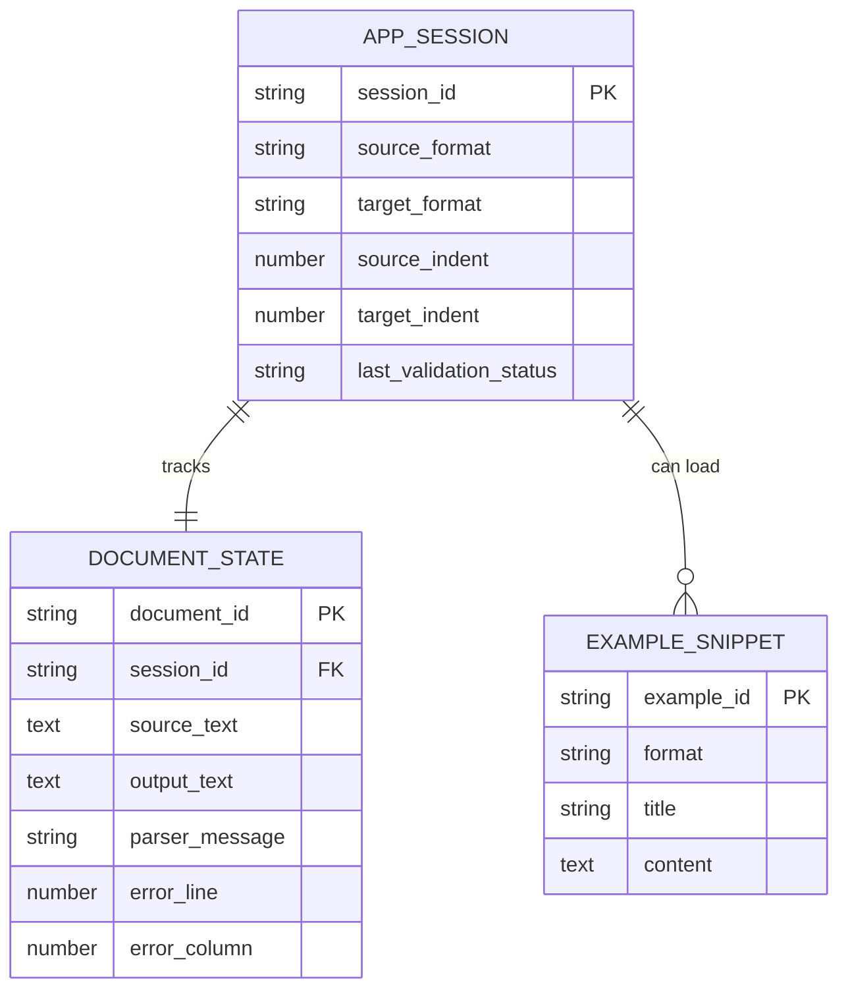

# Product Requirements -- json-yaml-spark-0606

## Overview

`json-yaml-spark-0606` is a polished static web app that converts JSON to YAML and YAML to JSON in the browser. It is for developers and technical users who need fast, trustworthy format conversion, clear validation feedback, and a responsive experience on desktop and mobile without sending their data to a server.

## Goals

1. Let users convert valid JSON to YAML and valid YAML to JSON with minimal friction.
2. Help users recover from invalid input quickly through explicit validation and human-readable parse errors.
3. Deliver a polished utility experience across desktop and mobile, including examples, copy actions, and stable formatting preferences.

## Non-Goals

- User accounts, cloud sync, or saved conversion history
- Arbitrary data transformation beyond JSON/YAML conversion and formatting
- Custom schema validation, lint-rule configuration, or collaboration features

## Personas

- **Developer on desktop:** pastes API payloads or config snippets, converts formats, copies result into code or documentation.
- **Operator or QA analyst on mobile/tablet:** needs to inspect or convert snippets while away from a laptop.
- **Learner/debugger:** uses examples and error explanations to understand why a payload fails.

## User Stories

### Core Conversion

- **REQ-001** As a developer, I want to convert valid JSON into YAML so that I can reuse payloads in config and documentation contexts.
  - Acceptance criteria:
    - [ ] Given valid JSON in the source editor and direction set to `JSON -> YAML`, triggering conversion produces YAML in the output panel.
    - [ ] The output is formatted with the currently selected YAML indentation setting.
    - [ ] The source text remains unchanged after conversion.

- **REQ-002** As a developer, I want to convert valid YAML into JSON so that I can reuse config-like documents in API and application contexts.
  - Acceptance criteria:
    - [ ] Given valid YAML in the source editor and direction set to `YAML -> JSON`, triggering conversion produces JSON in the output panel.
    - [ ] The output is formatted with the currently selected JSON indentation setting.
    - [ ] The resulting JSON is syntactically valid when reparsed by the app.

### Validation and Recovery

- **REQ-003** As a user, I want the app to validate my source input before and during conversion so that I know whether the problem is my data or the conversion step.
  - Acceptance criteria:
    - [ ] The UI shows a clear valid/invalid state for the current source input.
    - [ ] Invalid input prevents the output panel from being overwritten with misleading partial data.
    - [ ] Returning the input to a valid state clears the invalid state without a page refresh.

- **REQ-004** As a user debugging malformed data, I want clear parse errors with location and plain-language guidance so that I can fix the problem quickly.
  - Acceptance criteria:
    - [ ] When parsing fails, the UI displays the parser-reported line and column when available.
    - [ ] The error area includes a short explanation or hint in plain language, not only a raw parser string.
    - [ ] The source editor remains editable and the user can retry immediately after making changes.

### Usability and Productivity

- **REQ-005** As a repeat user, I want indentation settings to stay consistent until I change them so that output formatting matches my preferred style.
  - Acceptance criteria:
    - [ ] Users can choose indentation settings relevant to the active target format.
    - [ ] The chosen indentation values are reused on subsequent conversions until changed.
    - [ ] The chosen indentation values persist after a page refresh in the same browser.

- **REQ-006** As a user, I want to copy converted output in one action so that I can move it into another tool without manual selection.
  - Acceptance criteria:
    - [ ] A visible copy action is available when output exists.
    - [ ] Successful copy shows immediate confirmation feedback.
    - [ ] Copy failure shows a recoverable error message and does not clear the output.

- **REQ-007** As a new or blocked user, I want sample examples for both formats so that I can understand the app quickly or recover from a bad input state.
  - Acceptance criteria:
    - [ ] The UI offers at least one JSON example and one YAML example.
    - [ ] Loading an example clearly replaces or populates the source input.
    - [ ] Examples are valid and successfully convert in both directions.

- **REQ-008** As a desktop and mobile user, I want the app layout and controls to adapt to my screen so that conversion remains comfortable on both large and small devices.
  - Acceptance criteria:
    - [ ] On desktop-width layouts, source and output are visible without forced horizontal page scrolling.
    - [ ] On mobile-width layouts, the workflow remains usable in a single-column stacked layout.
    - [ ] Primary actions, format controls, validation state, and copy actions remain reachable without relying on hover.

## Non-Functional Requirements

| ID | Requirement | Target | How to Verify |
|----|-------------|--------|---------------|
| NFR-001 | First meaningful UI render | <= 2.0s on a mid-tier mobile profile over throttled 4G for the static app shell | Lighthouse or equivalent throttled audit |
| NFR-002 | Conversion responsiveness | <= 150ms for representative example payloads up to 100 KB on a modern desktop browser | Browser performance measurement |
| NFR-003 | Accessibility | Keyboard-operable controls, visible focus states, semantic labels, and WCAG AA contrast for core flows | Automated accessibility scan plus manual keyboard QA |
| NFR-004 | Mobile support | Fully usable from 375px viewport width upward | Responsive visual QA on 375px, 768px, and 1280px |
| NFR-005 | Privacy by design | No user document content is sent to a remote server during conversion | Architecture review plus network inspection |
| NFR-006 | Reliability of feedback | No uncaught runtime errors or console errors during core flows | Browser console verification during manual QA |
| NFR-007 | Preference durability | Indentation settings survive page refresh in the same browser | Manual refresh verification |

## Functional Scope Notes

- v1 includes one main converter workspace rather than separate apps or routes per format direction.
- Validation is syntax/parse validation only. The app does not validate against JSON Schema, OpenAPI, or custom YAML schemas.
- Examples are seeded local fixtures bundled with the app.

## Data Model

## Module Contracts

### Converter Service

- **Inputs:** `sourceText`, `sourceFormat`, `targetFormat`, `targetIndent`
- **Outputs on success:** `outputText`, `normalizedResultMeta`
- **Outputs on failure:** `rawError`, `normalizedError`, `line`, `column`
- **Rules:**
  - Parse source using the source-format parser before conversion.
  - Never emit partial converted output on parse failure.
  - Normalize parser failures into user-facing guidance.

### Preferences Store

- **Inputs:** `jsonIndent`, `yamlIndent`
- **Persistence:** browser-local storage or equivalent local persistence
- **Rules:**
  - Restore saved preferences during app startup.
  - Fall back to safe defaults if saved values are missing or invalid.

## Success Metrics

- A first-time user can load an example, convert it, and copy the output within one minute without instruction.
- A user with malformed input can identify where the error occurred and retry successfully without refreshing the page.
- The same workflow remains usable on a 375px mobile viewport and a 1280px desktop viewport.
