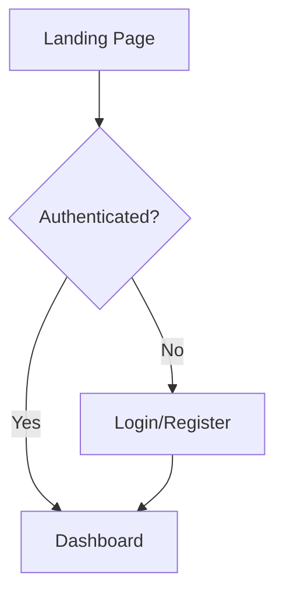

# UX Specification -- json-yaml-spark-0606

## User Flows

### {Flow 1}

## Key Screens

### {Screen 1}

**Purpose:** {What this screen does and why it exists}
**Entry points:** {How users get here}
**Key elements:**
- {Element 1}
- {Element 2}
- {Element 3}

**States:**
- **Loading:** {what shows}
- **Empty:** {what shows}
- **Error:** {what shows}
- **Populated:** {what shows}

**Accessibility notes:**
- {Keyboard behavior}
- {Screen reader expectations}
- {Color/contrast considerations}

**Performance notes:**
- {Expected payload / render behavior}
- {How this screen should behave on slower devices or 3G}

**Wireframe:**

  

    <b>{App Name}</b>
    Menu
  

  

    
{Page Title}

    

      {Low-fi wireframe content}
    

  

Mobile wireframe (375px+):

  

    <b>{App Name}</b>
    Menu
  

  

    
{Mobile Page Title}

    

      
{Primary card}

      
{Secondary card}

      
{Primary action}

    

  

