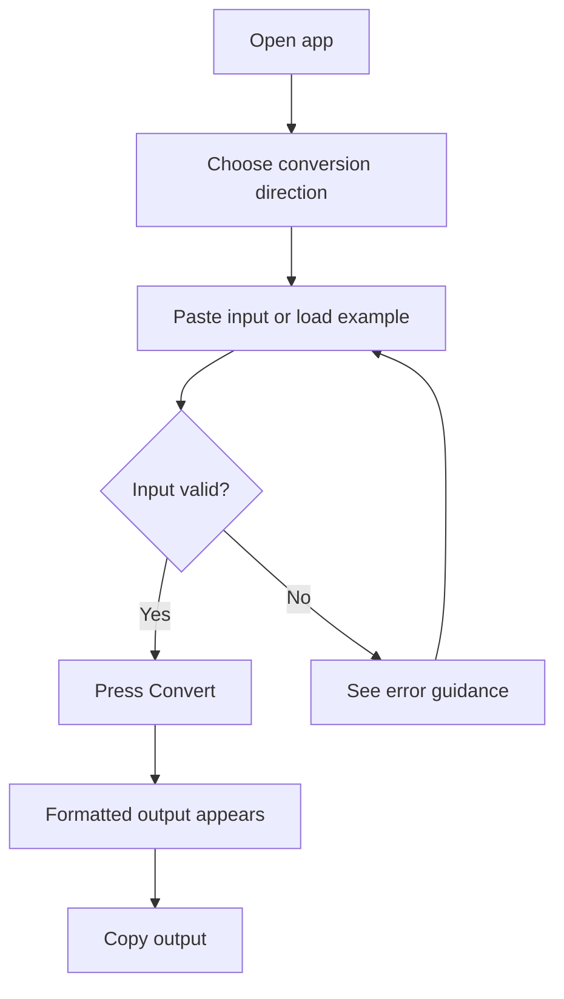
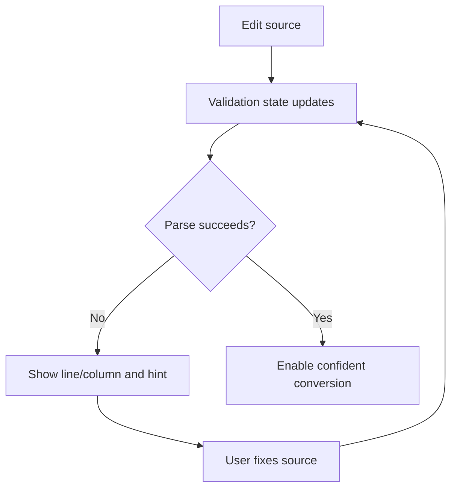
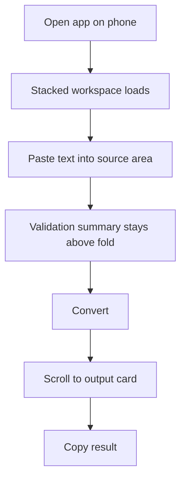

# UX Specification -- json-yaml-spark-0606

## UX Principles

- Keep the primary task visible: paste, validate, convert, copy.
- Make failure states easier to recover from than to misunderstand.
- Preserve a sense of control through explicit labels, stable preferences, and immediate feedback.
- Optimize layout by context: side-by-side on desktop, stacked and scroll-friendly on mobile.

## User Flows

### Convert a Valid Document

### Recover From Invalid Input

### Mobile Utility Flow

## Key Screens

### Main Converter Workspace

**Purpose:** Deliver the full core job in one place: format selection, input, validation, conversion, output, examples, and copy.

**Entry points:** Root URL, refresh, or direct visit from search/bookmark.

**Requirements served:** `REQ-001`, `REQ-002`, `REQ-003`, `REQ-005`, `REQ-006`, `REQ-008`

**Key elements:**

- Direction toggle: `JSON -> YAML` or `YAML -> JSON`
- Source editor with label, placeholder, and example loader
- Validation summary area
- Indentation controls for the target format
- Convert button
- Output panel with copy action

**States:**

- **Initial:** Empty source with example shortcuts and brief instructions.
- **Valid input:** Positive validation indicator and enabled conversion.
- **Invalid input:** Error banner and disabled or guarded conversion.
- **Converted:** Output visible with copy confirmation affordance after use.

**Accessibility notes:**

- Every control must have a programmatic label.
- Validation and copy feedback should use an `aria-live` region.
- Focus order should follow the top-down task order.
- Textareas must remain keyboard-resizable where platform conventions allow.

**Performance notes:**

- The app shell should render immediately without waiting on remote data.
- Validation should feel immediate for normal snippets without freezing typing.
- Example loading should be instant because examples are local fixtures.

**Desktop wireframe:**

  

    
<b>JSON ⇄ YAML Spark</b>
Local conversion. No server round trip.

    
Examples | Indent: 2 spaces

  

  

    

      
<b>JSON → YAML</b>

      
YAML → JSON

      
Valid input

    

    

      

        
<b>Source</b>Load example

        
{ "service": "api", "enabled": true }

        
Paste JSON or YAML here.

      

      

        
<b>Output</b>Copy

        
service: api
enabled: true

        
YAML formatted with current indentation settings.

      

    

    

      Error area stays hidden when valid. On failure it shows line, column, and a human-readable hint.
    

  

**Mobile wireframe (375px+):**

  

    <b>JSON ⇄ YAML Spark</b>
    
Fast local converter

  

  

    

      
<b>JSON → YAML</b>

      
YAML → JSON

    

    
Valid input

    

      <b>Source</b>
      
Paste here...

      
Examples

    

    

      
<b>Convert</b>

      
2 spaces

    

    

      
<b>Output</b>Copy

      

    

  

### Error Guidance Panel

**Purpose:** Turn parser failures into actionable fixes without forcing the user to decode raw parser terminology.

**Entry points:** Appears inline within the main workspace when validation or conversion fails.

**Requirements served:** `REQ-003`, `REQ-004`, `REQ-008`

**Key elements:**

- Error severity heading
- Line and column metadata when available
- Plain-language explanation
- Optional raw parser detail for advanced users
- Retry guidance or example fallback action

**States:**

- **Hidden:** No error exists.
- **Validation error:** Source cannot be parsed in current source format.
- **Clipboard failure:** Secondary inline message after unsuccessful copy attempt.

**Accessibility notes:**

- Error summary should be announced through a polite live region.
- Color cannot be the only indicator; use iconography or labels plus text.
- Raw error details should be expandable but still keyboard reachable.

**Performance notes:**

- Error rendering must not block further typing.
- Showing the panel should not reflow the whole page unpredictably on mobile; reserve space or anchor it near the source editor.

**Desktop wireframe:**

  

    <b>Input could not be parsed</b>
    Line 4, Column 9
  

  
Expected a `:` after the key name. Check the indentation and key/value separator near line 4.

  
Raw parser message: Implicit map keys need to be followed by map values.

  
Suggested next step: fix the highlighted line or load an example to compare the expected shape.

**Mobile wireframe (375px+):**

  <b>Parse error</b>
  
Line 4, Column 9

  
Check the missing `:` near the current line.

  
Show raw details

### Examples Drawer / Example Picker

**Purpose:** Provide safe starter content and recovery paths for users who need a working sample immediately.

**Entry points:** Main workspace example button or empty-state prompt.

**Requirements served:** `REQ-007`, `REQ-008`

**Key elements:**

- Example cards with title and format badge
- Replace confirmation text
- One-tap load action

**States:**

- **Collapsed:** Hidden behind an Examples button to keep the main task uncluttered.
- **Open:** Shows curated local sample snippets.
- **Replacing content:** Warns that loading an example will overwrite current source text.

**Accessibility notes:**

- If implemented as a drawer or modal, focus must move into it and return correctly on close.
- Example names should describe the sample content, not just its format.

**Performance notes:**

- Examples are static and bundled locally; the picker should open instantly.

## Content and Microcopy

- Primary CTA: `Convert`
- Copy action: `Copy output`
- Success feedback: `Copied to clipboard`
- Valid state: `Input is valid`
- Invalid state headline: `Input could not be parsed`
- Empty state helper: `Paste JSON or YAML, or load an example to start`

## Responsive Behavior

- `>= 1024px`: side-by-side source and output panes, controls in a single top action row
- `768px - 1023px`: two-column layout may remain, but controls can wrap to a second row
- `375px - 767px`: stacked cards, sticky primary action area if needed, no hover-only affordances

## Interaction Notes

- Validation can occur as the user edits, but conversion remains an explicit action to preserve a sense of control.
- Changing direction swaps labels, placeholders, validation messaging context, and target indentation controls.
- Copy is only enabled when output exists.
- Loading an example should visibly replace the current source text and immediately update validation state.
